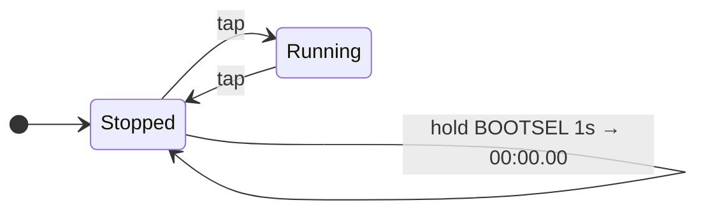

# ⏱ PiWatch


A centisecond stopwatch on a Raspberry Pi Pico 2 — 128×64 OLED, one button, and a buzzer.

<!-- Drop a photo or GIF of the finished build here:
                             -->

---

## Quick Start

1. Hold **BOOTSEL**, plug in USB, drag `Micropython UF2/RPI_PICO2-*.uf2` onto the `RPI-RP2` drive.
2. Wire it up — [8 wires](#wiring), takes two minutes.
3. Upload **both** files from `Python Files/` to the Pico's root with Thonny. Done.

---

## What It Does

- **Stopwatch** — `MM:SS.CC`, drift-free, in double-height text across the full display width.
- **One-button control** — tap to start, tap to stop. Hold BOOTSEL to reset.
- **Audible feedback** — different tone for start, stop, and reset.

---

## Wiring

Everything runs at 3.3 V. No transistor, no resistors — the buzzer drives straight from a GPIO.

### The 8 wires

| # | From | To | Pico pin |
|:-:|------|----|----------|
| 1 | OLED `VCC` | 3V3_OUT | **36** |
| 2 | OLED `GND` | GND | **38** |
| 3 | OLED `SDA` | GP4 | **6** |
| 4 | OLED `SCL` | GP5 | **7** |
| 5 | Buzzer `+` | GP15 | **20** |
| 6 | Buzzer `−` | GND | **38** |
| 7 | Button leg A | GP16 | **21** |
| 8 | Button leg B | GND | **38** |

Pins 38, and any other `GND`, are interchangeable — three wires share ground.

### Where those pins are

Pin 1 is top-left. Numbering runs **down** the left side (1–20), then **up** the right
side (21–40). Miscounting here is the single easiest way to damage the board, so check
the silkscreen on the underside rather than counting.

```
                  ┌─────── USB ───────┐
                  │                   │
    OLED SDA   6 ─┤ GP4               │
    OLED SCL   7 ─┤ GP5               │
                  │                   │
                  │    Pico 2         ├─ 40  VBUS
                  │    (RP2350)       ├─ 39  VSYS     ← battery + (optional)
                  │                   ├─ 38  GND      ← OLED −, buzzer −, button
                  │                   ├─ 37  3V3_EN
                  │                   ├─ 36  3V3_OUT  ← OLED +
    BUZZER +  20 ─┤ GP15              │
                  │              GP16 ├─ 21  ← button
                  └───────────────────┘
                   pins 1–20            pins 21–40
```

> [!WARNING]
> **Running on battery?** Connect the cell to **VSYS (pin 39)** — *never* 3V3_OUT (pin 36).
> Pin 36 is the regulator's **output**; back-driving it destroys the board. This has
> already killed one Pico on this project. Single-cell LiPo only (3.0–4.2 V); VSYS accepts
> 1.8–5.5 V via its buck-boost converter.

> [!NOTE]
> The buzzer must be a **passive** piezo. A passive buzzer has no oscillator of its own and
> needs a PWM square wave — an *active* buzzer will not work with this firmware.

---

## Setup

**Flash MicroPython** — hold BOOTSEL, connect USB, drag the `.uf2` from `Micropython UF2/`
onto the `RPI-RP2` drive. Use `RPI_PICO2-*.uf2` for the Pico 2, `RPI_PICO2_W-*.uf2` for the W.

**Upload the code** — in Thonny: *Preferences → Interpreter → MicroPython (Raspberry Pi Pico)*,
then **View → Files** and upload both files from `Python Files/` to the Pico's root:

| File | Why |
|------|-----|
| `main.py` | The application. Auto-runs on boot. |
| `ssd1306.py` | OLED driver. `main.py` imports it — nothing works without it. |

> [!TIP]
> `main.py` runs an infinite loop on boot, so Thonny often can't grab the REPL.
> Click **STOP**, or hold `Ctrl+C` while connecting.

---

## Using It

| Action | Do this | You'll hear |
|--------|---------|-------------|
| **Start / Stop** | Tap the button | 1800 Hz (start) · 1200 Hz (stop) |
| **Reset** | Hold **BOOTSEL** 1 s — only when stopped | Two chirps at 2600 Hz |

The **START** tile inverts while you hold the button. The **RESET** tile fills with a
progress bar as you hold BOOTSEL — it only appears when stopped, since reset is blocked
while running.

```
 ███     ███             ███     ███             ███     ███    
█   █   █   █     █     █   █   █   █           █   █   █   █   
█  ██   █  ██     █     █  ██   █  ██           █  ██   █  ██   
█ █ █   █ █ █           █ █ █   █ █ █           █ █ █   █ █ █   
██  █   ██  █     █     ██  █   ██  █           ██  █   ██  █   
█   █   █   █     █     █   █   █   █    ██     █   █   █   █   
 ███     ███             ███     ███     ██      ███     ███    
                                                                
                                                                
                                                                
                                                                
                                                                
▀▀▀▀▀▀▀▀▀▀▀▀▀▀▀▀▀▀▀▀▀▀▀▀▀▀▀▀▀▀▀▀▀▀▀▀▀▀▀▀▀▀▀▀▀▀▀▀▀▀▀▀▀▀▀▀▀▀▀▀▀▀▀▀
                                                                
                                                                
▐▀▀▀▀▀▀▀▀▀▀▀▀▀▀▀▀▀▀▀▀▀▀▀▀▀▀▀▀▀▀▌▐▀▀▀▀▀▀▀▀▀▀▀▀▀▀▀▀▀▀▀▀▀▀▀▀▀▀▀▀▀▀▌
▐                              ▌▐                              ▌
▐     ▗▄▖ ▄▄▖ ▗▄  ▄▄  ▄▄▖      ▌▐     ▄▄  ▄▄▖ ▗▄▖ ▄▄▖ ▄▄▖      ▌
▐     ▌    ▌  ▌ ▌ ▌ ▌  ▌       ▌▐     ▌ ▌ ▌   ▌   ▌    ▌       ▌
▐     ▝▀▖  ▌  ▛▀▌ ▛▛   ▌       ▌▐     ▛▛  ▛▀  ▝▀▖ ▛▀   ▌       ▌
▐     ▄▄▘  ▌  ▌ ▌ ▌▝▖  ▌       ▌▐     ▌▝▖ ▙▄▖ ▄▄▘ ▙▄▖  ▌       ▌
▐                              ▌▐                              ▌
▐                              ▌▐                              ▌
▐                              ▌▐                              ▌
▐                              ▌▐                              ▌
▐▄▄▄▄▄▄▄▄▄▄▄▄▄▄▄▄▄▄▄▄▄▄▄▄▄▄▄▄▄▄▌▐▄▄▄▄▄▄▄▄▄▄▄▄▄▄▄▄▄▄▄▄▄▄▄▄▄▄▄▄▄▄▌
```



---

## Configuration

<details>
<summary>Constants in <code>main.py</code></summary>

| Constant | Default | Description |
|----------|---------|-------------|
| `I2C_FREQ` | `400_000` | I2C clock (Hz). Drop to `100_000` if wiring is long. |
| `BOOTSEL_HOLD_MS` | `1000` | Hold time to reset (ms) |
| `TARGET_FPS` | `20` | Display refresh rate |
| `RESET_FLASH_MS` | `250` | Reset confirmation flash (ms) |
| `TRIPLE_TAP_WINDOW_MS` | `500` | Window for triple-tap detection (ms) |
| `GLITCH_RUN_MS` | `3000` | Glitch animation length (ms) |
| `BUZZER_PIN` | `15` | Buzzer GPIO |
| `BUZZER_ENABLED` | `True` | Set `False` to mute |
| `BUZZER_DUTY` | `16384` | 25% duty — quieter. **`0` and `65535` are both silent**; 32768 (50%) is loudest. |

Piezo buzzers are far louder at their resonant frequency, usually 2–4 kHz. To find yours:

```python
from machine import Pin, PWM
import time
b = PWM(Pin(15))
for f in range(500, 5001, 250):
    b.freq(f); b.duty_u16(32768); print(f, "Hz"); time.sleep_ms(300)
b.duty_u16(0)
```

</details>

<details>
<summary>How it works</summary>

**Timing** — `elapsed_us` accumulates small per-loop integer-microsecond deltas rather than
one long span. This is wrap-safe (`ticks_us()` rolls over every 2³⁰ µs, and `ticks_diff()`
is only valid across ±2²⁹ µs) and drift-free, since it's exact integers throughout.

**Rendering** — `oled.show()` pushes the entire 1024-byte framebuffer, about 23 ms at
400 kHz, so it only fires when something actually changed. `draw_time()` diffs per
character, repainting just the digits that moved — usually 1 or 2 of 8. Idle costs zero
I2C traffic.

**Big text** — `framebuf` has no scaling, so `draw_char_scaled()` rasterises each 8×8 glyph
into a scratch buffer and expands every set pixel into a 2×2 block. Eight characters ×
16 px = exactly 128 px, so the time fills the width precisely. 2× is the ceiling; 3× would
need 192 px.

**Input** — GP16 is active-low with an internal pull-up, edge-detected so one press gives
one toggle. BOOTSEL is polled via `rp2.bootsel_button()`, which returns **1 when pressed**.

</details>

---

## Troubleshooting

| Symptom | Check |
|---------|-------|
| `I2C scan: []` | SDA on pin 6, SCL on pin 7. Reseat wires. Try address `0x3D`. |
| Display blank but scan works | OLED `VCC` on pin **36**, not 39. |
| No sound | Passive buzzer, not active? Run the frequency sweep above. |
| Buzzer quiet | Raise `BUZZER_DUTY` toward `32768` — **not** past it. |
| Resets on its own | Should not happen; `rp2.bootsel_button()` returns 1 when pressed. |
| Thonny won't connect | Charge-only USB cable. Try another. |

---

## Project Structure

```
Micropython UF2/     Firmware — RPI_PICO2-*.uf2 (Pico 2) · RPI_PICO2_W-*.uf2 (Pico 2 W)
Python Files/        main.py + ssd1306.py — upload BOTH to the Pico's root
README.md            This file
```

---

<sub>*There's something hidden in the button handling. Try tapping it three times, quickly.*</sub>

---

## Credits

Built with assistance from several AI models:

| Model | Contribution |
|-------|-------------|
| **Qwen 3.82-27B** | Core stopwatch, I2C OLED integration, time accumulation, display rendering, button handling, initial architecture |
| **Qwen 3.6-35B-A3B** | Buzzer implementation, glitch easter egg, triple-tap detection, non-blocking sound, UI tile rendering |
| **Claude Opus 5** | Bug fixes — BOOTSEL polarity, `ticks_us()` wrap handling, PWM duty-cycle correction, I2C pinout resolution. Hardware troubleshooting. Authored this README, including the wiring guide and display mockups. |

OLED driver: [micropython-ssd1306](https://github.com/mcauser/micropython-ssd1306) ·
[MicroPython docs](https://docs.micropython.org/)

---

Provided as-is for educational and personal use. Modify and distribute freely.
